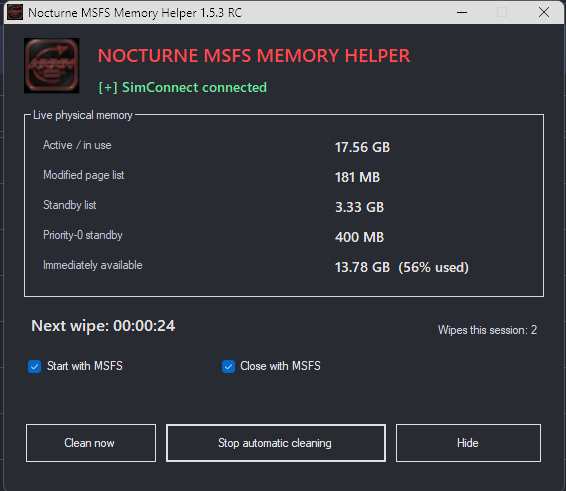
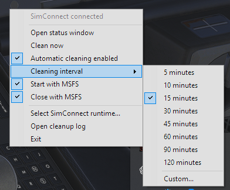

# Nocturne MSFS Memory Helper

Nocturne MSFS Memory Helper—or **NMMH**—is a lightweight Windows tray utility for Microsoft Flight Simulator 2024.

It was created to reduce the performance degradation I experience as physical system memory becomes crowded. This pressure can begin during initial simulator startup, while loading into an aircraft, or whenever MSFS loads new scenery, airports, traffic, camera views, or other assets.

> **Release status:** 1.5.5 RC connects to MSFS 2024 without needing a separate SimConnect DLL or SDK setup. It is working on my system, but I cannot promise the same results on every hardware, add-on or streaming configuration.

## Interface

### Status window

### Tray controls

## What NMMH does

Each cleanup performs two complete system-wide passes:

1. Empty Windows working sets.
2. Flush the modified page list.
3. Purge the standby list.
4. Purge the priority-0 standby list.
5. Wait two seconds for Windows to finish redistributing memory.
6. Repeat the complete sequence.

The second pass is intentional. During testing, the first pass frequently pushed a large amount of memory into compressed or modified states. The second pass cleaned much of the memory created by the first operation and produced a substantially larger reduction in active physical-memory use.

NMMH uses Windows' own native memory-management interfaces. It does not modify MSFS files, aircraft, flight plans, simulator variables, or graphics settings. It does not inject code into MSFS or directly clear dedicated VRAM.

## Why it may help MSFS

The problem is not simply that MSFS allocates a large amount of memory. The problem appears when previously loaded data remains physically resident while the simulator continues loading more.

Shared GPU memory is backed by physical system RAM. MSFS's normal process memory and part of its graphics workload can therefore compete within the same physical-memory pool. As that pool becomes crowded, Windows and WDDM must increasingly move, page, and make resources resident while MSFS is trying to render the next frame.

In my testing, performance degradation consistently begins as this memory pressure and residency activity increase. Restoring physical-memory headroom reduces that churn and gives MSFS room for its next loading operation.

NMMH does not claim to fix every MSFS performance problem. It is intended to reduce one repeatable source of degradation: accumulating physical-memory pressure.

## Features

- One normally compiled C# executable; no PowerShell or VBS components
- Live physical-memory monitoring
- Manual **Clean now** button
- Configurable automatic-cleaning interval
- Start with MSFS and Close with MSFS options
- Tray controls and status window
- Cleanup progress for both passes
- Cleanup log
- Hard SimConnect safety gate

Cleaning is disabled without a live SimConnect connection. The elevated worker also refuses missing, stale, or unapproved cleanup requests. Automatic cleaning always starts disabled when NMMH opens.

## Download and use

[Download Nocturne MSFS Memory Helper 1.5.5 RC](https://github.com/WintxrWhisper/Nocturne-Msfs-Memory-Helper-NMMH/releases/download/v1.5.5-rc/Nocturne-MSFS-Memory-Helper-1.5.5-RC.zip), extract the complete folder to a permanent location, and read the included `README.txt` before running NMMH.

### Antivirus notice — 1.5.5 RC

Microsoft has flagged a build as `Trojan:Win32/Wacatac.C!ml`. I believe this is a false positive. NMMH uses Windows memory-management functions and asks for administrator approval to set up its cleanup worker. It does not inject code into MSFS, download other programs or contain hidden scripts.

The full source and build instructions are here if you want to check it yourself or compile your own copy. [Here is the VirusTotal report](https://www.virustotal.com/gui/file/0a66e18f023d811e3e52e2fc92b7f61d55a65623b6add1035f2ec944506fe095). Scan results apply to the exact file hash, so check yours against the release's `SHA256SUMS.txt`. More details are in [SECURITY.md](SECURITY.md).

The first cleanup requests administrator approval once. NMMH then registers its elevated cleanup worker so later cleanups do not produce recurring UAC prompts. Keep the EXE in the same location after authorization because the scheduled tasks point to that exact path.

## SimConnect: no SDK or DLL setup

NMMH connects directly to MSFS 2024's standard local SimConnect pipe, regardless of where Steam or Microsoft Store installed the simulator. No SDK installation, DLL download, or file picker is needed. Previously saved DLL paths are ignored.

Cleaning stays locked until NMMH verifies the pipe belongs to the detected simulator, receives its SimConnect OPEN reply, and gets a matching reply to its own read-only heartbeat request. Disconnects, missing replies, and simulator exit lock cleaning again; the client automatically retries. This does not read or write MSFS process memory.

If it keeps waiting after MSFS starts, check the cleanup log and include the exact status text in your report. Custom/remote SimConnect endpoints are not supported. See [the connection implementation notes](docs/SimConnect.md) for details.

Exit the old NMMH version before upgrading. The new executable path may require one administrator approval to update the scheduled worker.

## Expected behavior and safety

A cleanup may cause a large and immediate drop in active physical-memory use. Committed memory may change much less because applications still own their virtual-memory allocations.

MSFS may briefly stutter while required pages and assets are loaded back into physical RAM. These operations affect Windows memory globally, so save important work and avoid cleaning during rendering, exporting, compiling, recording, or any other operation you cannot afford to interrupt.

Livestreaming, recording software, and MSFS installations that primarily stream world content have not yet been thoroughly tested. My own installation contains everything currently available for local download, so other configurations may behave differently.

## Building from source

NMMH builds on Windows 10 or Windows 11 using the C# compiler included with Microsoft .NET Framework 4.8. Visual Studio is not required.

1. Download or clone the repository.
2. Run `Build-NMMH.cmd`.
3. Find the compiled EXE and release ZIP inside the generated `release` folder.

See [BUILDING.txt](BUILDING.txt) for the compact build instructions and [README.txt](README.txt) for the complete user guide.

## Reports and updates

i will not be monotring reports, or any more infromation, if an update is needed, it will happen, otherwise, it will live as is, im tired of finding probelms only to be talked down to because of my ablity to type, and asstance with an ai for my spelling and launage. so. whatever. enjoy it, if i update it, then cool, otherwise, enjoy it while it works. 

## License

NMMH is released under the [MIT License](LICENSE).
